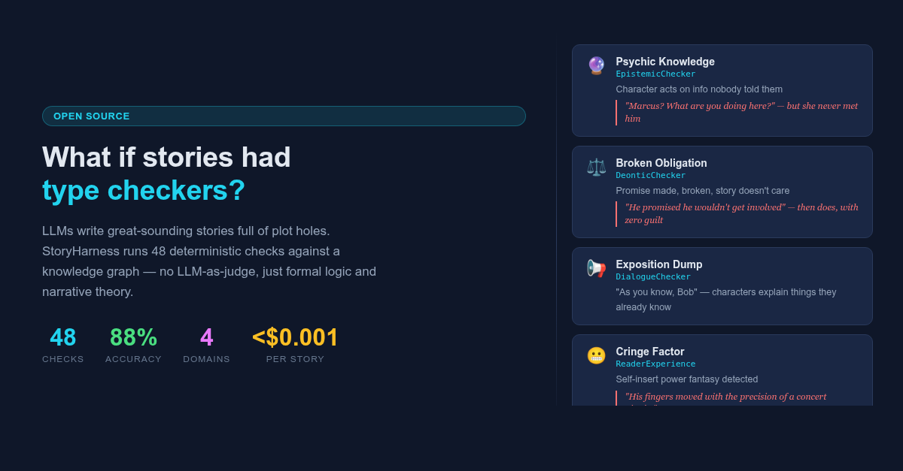
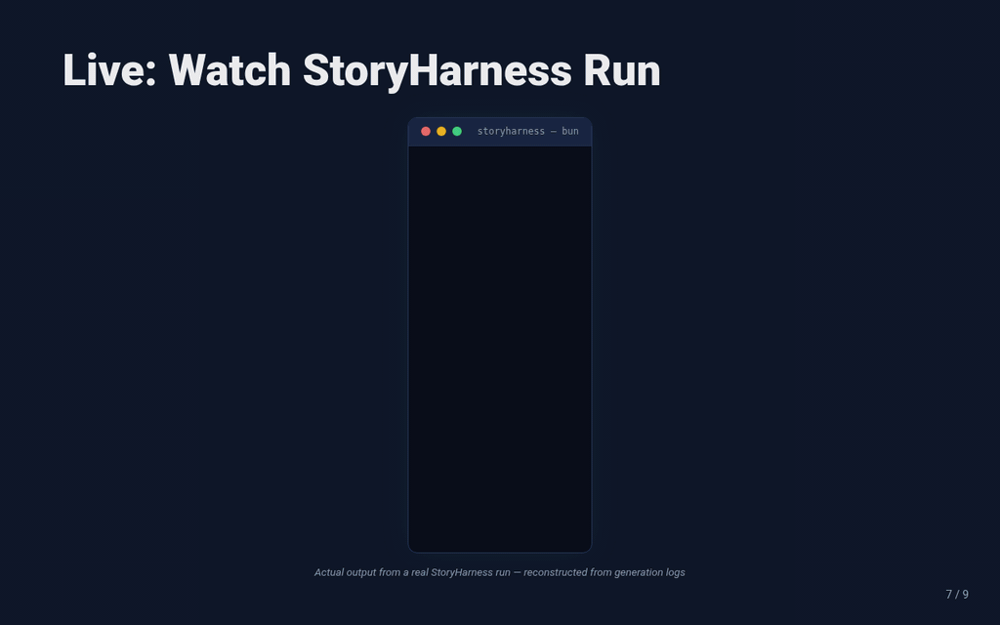

[](https://shawn-yang-google.github.io/story-harness/)

# StoryHarness

A framework that bridges structured AI generation and the nuanced art of human storytelling. StoryHarness automatically synthesizes code harnesses that act as a strict control loop for LLMs, evaluating and guiding narrative generation across critical dimensions — logic, structure, emotion, tension, style, character, and dialogue.

Inspired by [AutoHarness](https://arxiv.org/html/2603.03329v1) (LLM-synthesized code harnesses via tree-search), adapted from game environments to narrative generation.

> 📊 **[View the interactive presentation →](https://shawn-yang-google.github.io/story-harness/)**

<p align="center">
  
</p>

## How It Works

StoryHarness uses a **four-tier critic system** and a **gated pipeline** to evaluate LLM-generated narrative drafts:

```
Prompt ──► LLM Draft ──► Gate 1 (Code) ──► Gate 2 (Hybrid) ──► Gate 3 (Prompt) ──► Accept
                              ▲                                            │
                              └──── diff-based patches from feedback ──────┘
```

| Tier | What | Speed | Cost | Used | Origin |
|------|------|-------|------|------|--------|
| **Tier 1** | Deterministic TypeScript code | <5ms | Free | Inference | **Synthesized** — tree-search + Thompson sampling, trained against Tier 4 labels |
| **Tier 2** | LLM extract + code verify | ~300ms | ~$0.0002 | Inference | **Expert-crafted** — hand-written extraction prompts and 66 deterministic checkers |
| **Tier 3** | LLM prompt evaluation | ~500ms | ~$0.0002 | Inference (subjective only) | **Synthesized** — prompt text refined by Gemini 2.5 Flash, trained against Tier 4 labels |
| **Tier 4** | Gemini 2.5 Pro LLM-as-Judge | Slow | Expensive | Training only | N/A — the oracle judge itself |

> **Note:** Tier 4 trains **only** Tier 1 and Tier 3. Tier 2 harnesses are hand-crafted — their extraction prompts and checker modules are written by domain experts, not synthesized. The "rejection sampling" terminology in this project is used loosely: the training phase is technically a **tree-search optimization with Thompson sampling**, where candidate harnesses that disagree with Tier 4 are discarded (analogous to rejection sampling in spirit, not the strict statistical sense).

Rejected drafts receive targeted feedback and are refined through minimal diff-based patches before re-evaluation.

## Getting Started

### Prerequisites

- [Bun](https://bun.sh) >= 1.3
- A `GEMINI_API_KEY` environment variable

### Install

```bash
bun install
```

### Train a Harness

```bash
# Train a Tier 1 code harness (generates TypeScript)
bun run src/cli/index.ts train LogicHarness --auto

# Train a Tier 3 prompt harness (generates .prompt.txt)
bun run src/cli/index.ts train LogicHarness --mode prompt --auto
```

| Flag | Default | Description |
|------|---------|-------------|
| `--auto` | off | Run to convergence (H ≥ 0.95 for 3 consecutive iterations) |
| `--interactive` | off | Pause for human approval each iteration |
| `--mode code\|prompt` | `code` | Tier 1 (TypeScript) or Tier 3 (LLM prompt) |
| `--ts-weight <n>` | `1.0` | Thompson Sampling exploration weight |
| `--max-iterations <n>` | `10` | Upper bound on training iterations |

### Generate a Story

```bash
# Simple generation (single scene)
bun run src/cli/index.ts generate "A detective arrives at a crime scene"

# Generate from a .md file
bun run src/cli/index.ts generate story-prompt.md
```

### Writer Personas

Create a **writer persona** to customize the LLM's voice and control which harnesses/checkers are active:

```bash
# Interactive persona builder (LLM suggests defaults based on the name)
bun run src/cli/index.ts create-persona "noir detective writer"

# List available personas
bun run src/cli/index.ts list-personas

# Generate with a persona
bun run src/cli/index.ts generate "A body is found in the study" \
  --persona personas/noir-detective-writer.json
```

Each persona JSON includes genre, tone, style, audience, enabled harnesses, checker flags, and tunable thresholds — all editable:

```json
{
  "name": "noir detective writer",
  "genre": "mystery",
  "tone": "dark",
  "style": "minimalist",
  "enabledHarnesses": ["StyleHarness.ts", "StructureHarness.ts", ...],
  "checkerConfig": {
    "enabledCheckers": { "propositional": true, "soundness": true, ... },
    "thresholds": { "maxExclamationMarks": 2, "minWords": 500, ... }
  }
}
```

### Multi-Section Stories

For longer stories, split the prompt into sections and generate each one sequentially:

```bash
# Auto-split and generate
bun run src/cli/index.ts generate story-prompt.md \
  --persona personas/literary-fiction.json \
  --multi-section --max-words-per-section 800

# Or: split first, review the plan, then generate
bun run src/cli/index.ts split story-prompt.md --max-words-per-section 800
# Edit plans/plan-*.json to adjust sections...
bun run src/cli/index.ts generate --plan plans/plan-2026-04-30.json \
  --persona personas/literary-fiction.json
```

### Check a Draft

Run harnesses against an existing draft without correction — just diagnosis:

```bash
# Check with all harnesses
bun run src/cli/index.ts check draft.md

# Check with a persona (only relevant harnesses + checkers)
bun run src/cli/index.ts check draft.md --persona personas/noir-detective.json

# Check with specific harnesses only
bun run src/cli/index.ts check draft.md --harness Style,Logic,Character
```

### Run Tests

```bash
bun test    # 317 tests across 40 files
```

## Documentation

Detailed documentation lives in the [`docs/`](docs/) directory:

### Architecture
- **[System Architecture](docs/architecture.md)** — Training/inference phases, gated pipeline, two-level loop, harness loading, log structure, LLM model strategy

### Evaluation Tiers
- **[Tier 1 — Code Harnesses](docs/tiers/tier-1-code.md)** — Deterministic TypeScript harnesses, tree-search + Thompson sampling
- **[Tier 2 — Hybrid Harnesses](docs/tiers/tier-2-hybrid.md)** — "LLM Extracts, Code Verifies", 48 checks across 4 domains
- **[Tier 3 — Prompt Harnesses](docs/tiers/tier-3-prompt.md)** — Pure LLM evaluation for subjective domains
- **[Tier 4 — LLM-as-Judge](docs/tiers/tier-4-judge.md)** — Gemini 2.5 Pro critic for training ground-truth

### Design Philosophy
- **[Design Philosophy](docs/design-philosophy.md)** — Why harnesses are verifiers, not creativity drivers

### Domain Guides
- **[Logic](docs/domains/logic.md)** — 27 checks: propositional, temporal, epistemic, deontic, entity, causal
- **[Dialogue](docs/domains/dialogue.md)** — 8 checks: subtext, exposition, conflict, voices, clichés
- **[Character](docs/domains/character.md)** — 6 checks: mask vs truth, pressure choice, dimensions, desire
- **[Narrative](docs/domains/narrative.md)** — 7 checks: turning values, stakes, goals, theme, conflict

## Project Structure

```
storyharness/
├── src/
│   ├── cli/              # CLI entrypoints (train, generate, split, check, create-persona)
│   │   ├── prompt-loader.ts  # Load prompts from .md/.txt files
│   │   └── index.ts          # Main CLI dispatcher
│   ├── persona/          # Writer persona system
│   │   ├── index.ts          # WriterPersona type, GENRES/TONES/STYLES/EMPHASES
│   │   ├── harness-map.ts    # Genre→harness mapping + exclusion reasons
│   │   ├── persona-config.ts # Checker flags + thresholds per genre (66 rules)
│   │   ├── prompt-builder.ts # LLM system prompt from persona
│   │   └── suggest.ts        # LLM-based default suggestions for persona creation
│   ├── runner/           # Rejection sampling inference loop
│   │   ├── story-splitter.ts # LLM-based story section splitting
│   │   └── multi-section.ts  # Sequential multi-section generation
│   ├── environment/      # Trajectory loader, sandbox, critics, LLM harness
│   ├── llm/              # Gemini API client & model configuration
│   ├── synthesizer/      # Tree-search, Thompson sampling, code/prompt synthesis
│   ├── types/            # Core interfaces (LogicGraph, DialogueGraph, etc.)
│   ├── logic/            # 9 logic checker modules (30 rules)
│   ├── dialogue/         # Dialogue checker (8 rules)
│   ├── character/        # Character checker (11 rules)
│   └── narrative/        # Narrative checker (12 rules, incl. editorializing ending)
├── harnesses/            # Generated harnesses (.ts, .hybrid.json, .prompt.txt)
├── personas/             # Writer persona JSON files
├── plans/                # Story split plans (from 'split' command)
├── output/               # Generated story output (.md files)
├── datasets/             # Training trajectories (.json)
├── docs/                 # Documentation (architecture, tiers, domains)
└── arxiv.md              # AutoHarness paper reference
```

## License

This project is licensed under the [MIT License](LICENSE).

The skill files in `character/`, `dialogue/`, and `story/` contain AI-generated
summaries of narrative craft principles from Robert McKee's books. See
[NOTICE.md](NOTICE.md) for full attribution and fair use rationale.

## References

- [AutoHarness: Improving LLM Agents by Automatically Synthesizing a Code Harness](https://arxiv.org/html/2603.03329v1)
- McKee, R. — *Story* (1997), *Dialogue* (2016), *Character* (2021)
